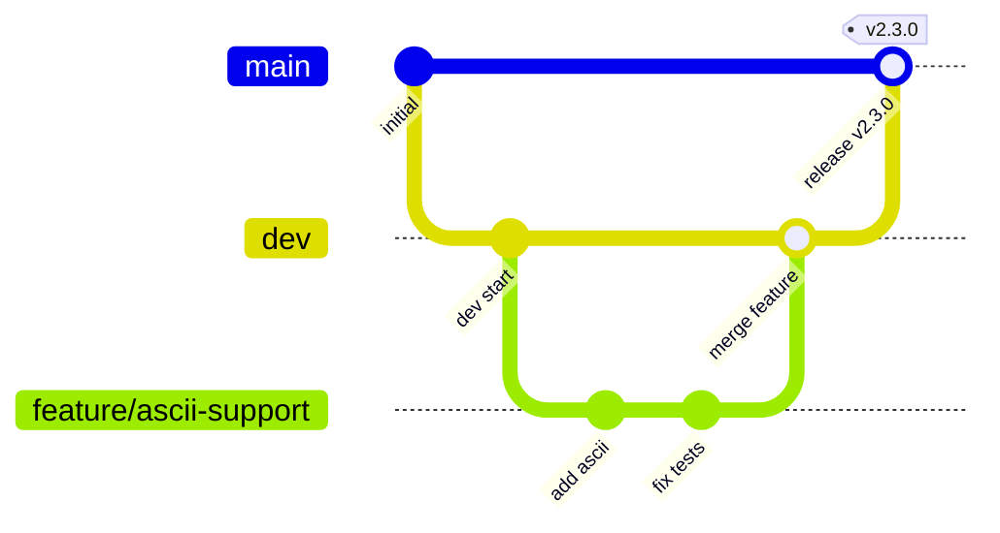

## En [Ru](CONTRIBUTING_RU.md)

# Contributing to UDP Packet Generator

Thank you for your interest in contributing!  
Here you will find guidelines for reporting bugs, suggesting features, and submitting pull requests.

## Bug Reports

If you encounter a bug, please [open an issue](https://github.com/UdpPacketGenerator/UdpPacketGenerator/issues/new) and include:

- application version (or release tag)
- operating system
- steps to reproduce
- expected vs actual behavior
- if possible, attach the JSON template that triggers the issue

## Feature Requests

Ideas and suggestions are welcome as well. Open an issue describing what you would like to add and why it would be useful. We can then discuss the technical implementation.

## Adding JSON Templates

We welcome JSON templates for popular protocols or test scenarios (Modbus, NMEA, telemetry, etc.).  
To contribute a template:

1. Place the `.json` file in the [`templates/`](templates/) folder.
2. Make sure the template follows the [Template guide](templates/README.md).
3. If applicable, add a short description to `templates/README.md` (and `templates/README_RU.md`) and/or a usage example.
4. Submit a Pull Request targeting the `dev` branch.

## Pull Request Process

1. **Fork** the repository and create a branch from `dev` with a descriptive name (`fix-crash-empty-payload`, `feature/ascii-support`).
2. Make your changes, following the code style described below.
3. Ensure the project compiles without errors (CMake, Qt 6.8+, C++17).
4. If you add a new feature, consider adding tests or an example template.
5. Open a Pull Request to `dev` with a clear description of the changes.
6. Your PR will be reviewed, and changes may be requested.

```
git checkout dev
git pull origin dev
git checkout -b fix-crash-empty-payload   # or feature/your-feature-name
```

>⚠️ Important: All changes must be based on the `dev` branch, not on `main`. `main` is reserved for stable releases and does not accept new features directly.



## Code Style

- **C++17**, Qt 6 (Widgets)
- Indentation: 4 spaces
- Project provides a `.clang-format` file in the root directory.  
  Use [Clang-Format](https://clang.llvm.org/docs/ClangFormat.html) with this configuration for automatic formatting.
- Comments are appreciated, especially for non-obvious logic.

### Naming conventions

| Entity                            | Style             | Example                                              |
|:---------------------------------|:------------------|:-----------------------------------------------------|
| Classes, structs, enums          | PascalCase        | `class UserAccount`, `struct Point3D`, `enum class ColorType` |
| Functions (global and methods)   | camelCase         | `getUserBalance()`, `calculateTotal()`, `setName()`   |
| Local variables and parameters   | camelCase         | `userName`, `totalCount`, `maxRetries`                |
| Class members                    | `m_` + camelCase | `m_name`, `m_count`                                 |
| Constants and `constexpr`        | `k` + PascalCase  | `kMaxSize`                                           |
| Enum class values                | PascalCase        | `enum class Color { Red, Green, Blue };`          |
| Macros                           | SNAKE_UPPER_CASE  | `TOTAL_COUNT`                                        |
| Namespaces                       | PascalCase        | `namespace MySpace`                                  |
| Type aliases (`using`/`typedef`) | PascalCase        | `using UserId = int32_t;`, `typedef std::vector<int> IntVector;` |
| Template parameters              | PascalCase or single uppercase letter | `template <typename ElementType>`, `template <class T>` |
| Directories and source files     | snake_lower_case  | `ui/my_form.cpp`                                     |

## License

The project is licensed under the [MIT License](LICENSE).  
By contributing, you agree that your code will be distributed under the same license.

## Communication

Questions and discussions can take place in issues or in [Discussions](https://github.com/UdpPacketGenerator/UdpPacketGenerator/discussions).  
Pull Requests, documentation, and templates – all contributions are gratefully received!
