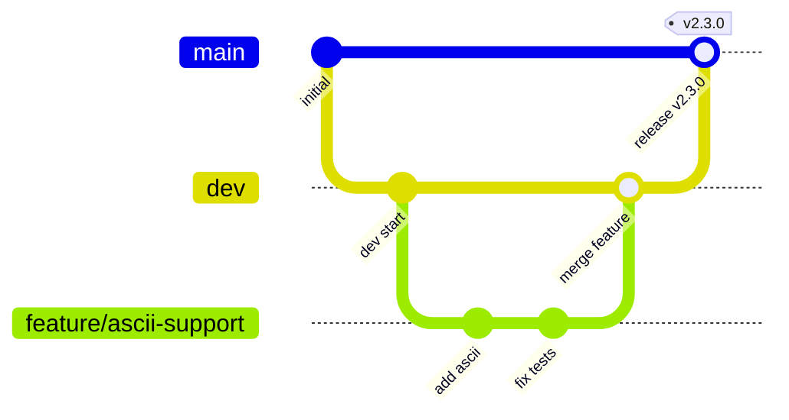

## [En](CONTRIBUTING.md) Ru

# Участие в разработке UDP Packet Generator

Благодарим за интерес к проекту!  
Ниже описаны правила и рекомендации для сообщений об ошибках, предложений и pull request'ов.

## Сообщения об ошибках

Если вы обнаружили ошибку, пожалуйста, [создайте issue](https://github.com/UdpPacketGenerator/UdpPacketGenerator/issues/new) и укажите:

- версию приложения (или тег релиза)
- операционную систему
- шаги для воспроизведения
- ожидаемое и фактическое поведение
- по возможности приложите JSON-шаблон, на котором проявляется ошибка

## Предложения по улучшению

Идеи и пожелания также приветствуются. Создайте issue, описав, что вы хотите добавить и почему это будет полезно. Мы обсудим техническую реализацию.

## Добавление JSON-шаблонов

Мы рады шаблонам для популярных протоколов или тестовых сценариев (Modbus, NMEA, телеметрия и т.д.).  
Чтобы добавить шаблон:

1. Поместите файл `.json` в папку [`templates/`](templates/).
2. Убедитесь, что шаблон соответствует [руководству по шаблонам](templates/README_RU.md).
3. При необходимости добавьте краткое описание в `templates/README.md` (и `templates/README_RU.md`) и/или пример использования.
4. Создайте Pull Request в ветку `dev`.

## Процесс Pull Request

1. **Сделайте форк** репозитория и создайте ветку от `dev` с осмысленным названием (`fix-crash-empty-payload`, `feature/ascii-support`).
2. Внесите изменения, следуя стилю кода, описанному ниже.
3. Убедитесь, что проект компилируется без ошибок (CMake, Qt 6.8+, C++17).
4. Если вы добавляете новую функциональность, по возможности добавьте тесты или пример шаблона.
5. Откройте Pull Request в `dev` с чётким описанием изменений.
6. Ваш PR будет рассмотрен, могут быть запрошены правки.

git checkout dev
git pull origin dev
git checkout -b fix-crash-empty-payload   # или feature/your-feature-name

>⚠️ Важно: Все изменения должны базироваться на ветке dev, а не на main. main зарезервирована для стабильных релизов и не принимает новые фичи напрямую.

## Стиль кода

- **C++17**, Qt 6 (Widgets)
- Отступы: 4 пробела
- В корне проекта находится файл `.clang-format`.  
  Используйте [Clang-Format](https://clang.llvm.org/docs/ClangFormat.html) с этой конфигурацией для автоматического форматирования.
- Комментарии приветствуются, особенно для неочевидной логики.

### Соглашения об именовании

| Сущность                          | Стиль             | Пример                                               |
|:----------------------------------|:------------------|:-----------------------------------------------------|
| Классы, структуры, перечисления   | PascalCase        | `class UserAccount`, `struct Point3D`, `enum class ColorType` |
| Функции (глобальные и методы)     | camelCase         | `getUserBalance()`, `calculateTotal()`, `setName()`   |
| Локальные переменные и параметры  | camelCase         | `userName`, `totalCount`, `maxRetries`                |
| Члены класса                      | `m_` + camelCase | `m_name`, `m_count`                                 |
| Константы и `constexpr`           | `k` + PascalCase  | `kMaxSize`                                           |
| Значения enum class               | PascalCase        | `enum class Color { Red, Green, Blue };`          |
| Макросы                           | SNAKE_UPPER_CASE  | `TOTAL_COUNT`                                        |
| Пространства имён                 | PascalCase        | `namespace MySpace`                                  |
| Псевдонимы типов (`using`/`typedef`) | PascalCase    | `using UserId = int32_t;`, `typedef std::vector<int> IntVector;` |
| Параметры шаблонов                | PascalCase или одна заглавная буква | `template <typename ElementType>`, `template <class T>` |
| Директории и исходные файлы       | snake_lower_case  | `ui/my_form.cpp`                                     |

## Лицензия

Проект распространяется под лицензией [MIT License](LICENSE).  
Предоставляя свой код, вы соглашаетесь с его распространением на тех же условиях.

## Общение

Вопросы и обсуждения можно вести в issues или в [Discussions](https://github.com/UdpPacketGenerator/UdpPacketGenerator/discussions).  
Pull Request'ы, документация и шаблоны – все виды участия приветствуются!
